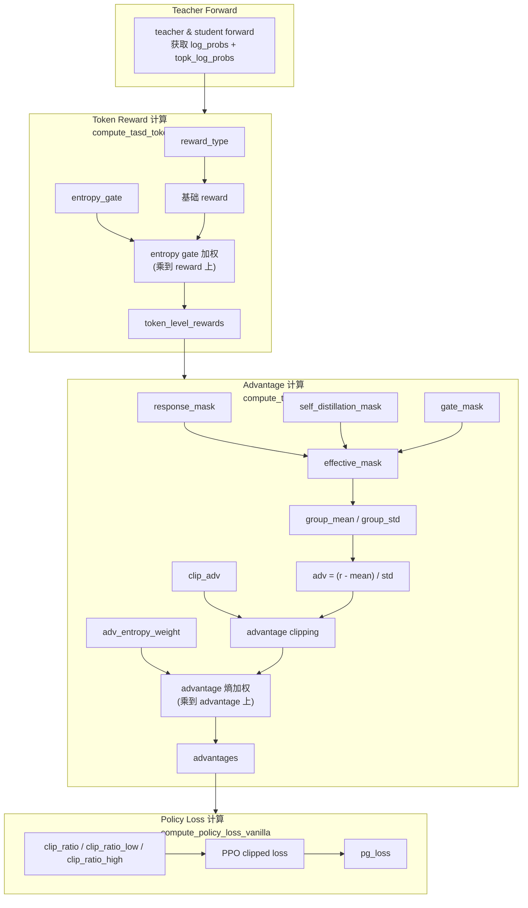
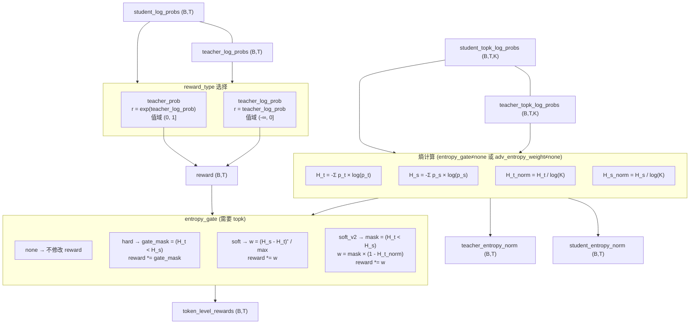
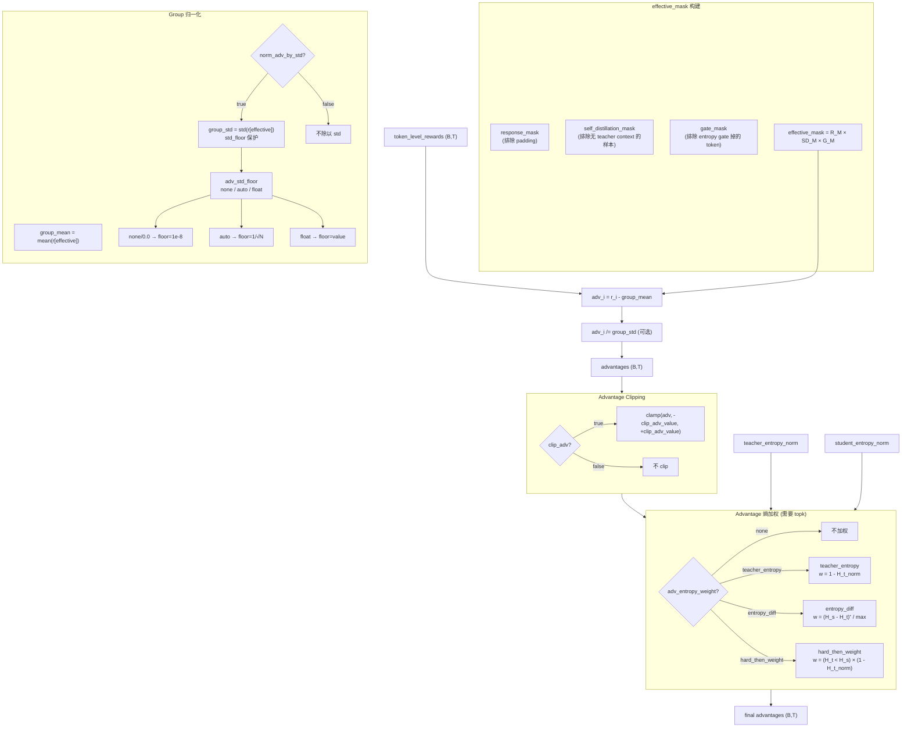
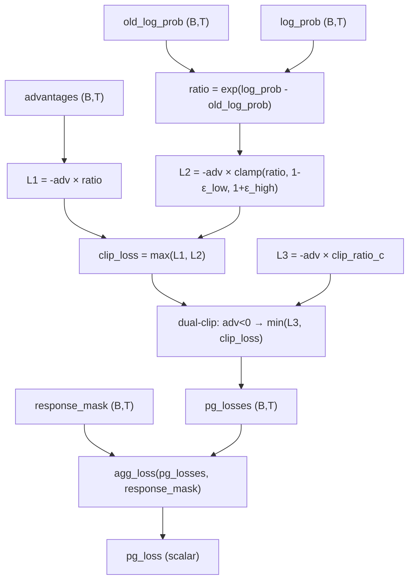
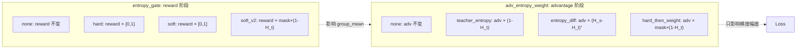
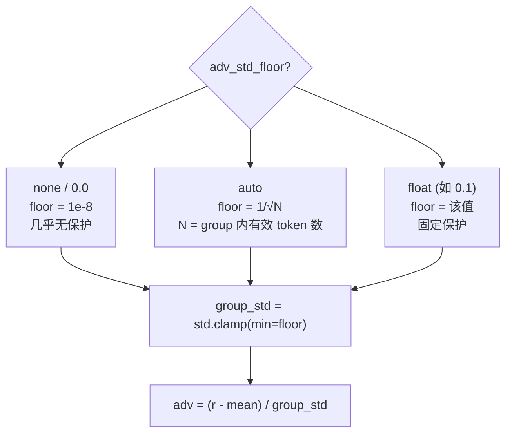
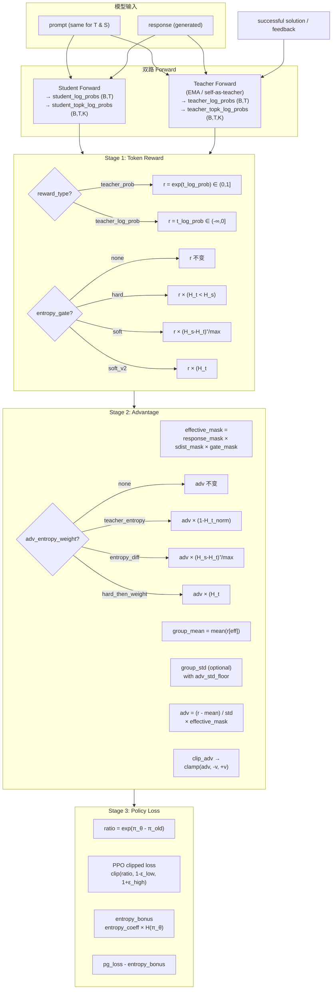

# TASD: From Reward to Loss

本文档描述 TASD 算法中 token-level reward 从计算到最终 policy loss 的完整链路，
以及各实验参数对链路的影响。

---

## 1. 整体流程

---

## 2. Stage 1: Token Reward 计算

**函数**: `compute_tasd_token_rewards` in `core_algos.py`

### 参数说明

| 参数 | 值域 | 默认 | 说明 |
|------|------|------|------|
| `reward_type` | `teacher_prob` / `teacher_log_prob` | `teacher_prob` | reward 计算方式 |
| `entropy_gate` | `none` / `hard` / `soft` / `soft_v2` | `none` | 熵门控模式 |
| `distill_topk` | int | 100 | top-k 规模（熵计算需要） |

**关键**：`entropy_gate` 在 **reward 阶段** 乘权重，会影响后续 `group_mean` 的计算。

---

## 3. Stage 2: Advantage 计算

**函数**: `compute_tasd_advantage` in `core_algos.py`

### 参数说明

| 参数 | 值域 | 默认 | 说明 |
|------|------|------|------|
| `norm_adv_by_std` | `true` / `false` | `false` | 是否除以 group std |
| `adv_std_floor` | `none` / `auto` / float | `0.0` | std 下界保护 |
| `clip_adv` | `true` / `false` | `true` | 是否 clip advantage |
| `clip_adv_value` | float | `2.0` | advantage clip 范围 [-v, +v] |
| `adv_entropy_weight` | `none` / `hard_filter` / `teacher_conf` / `teacher_conf_filtered` / `certainty_diff_filtered` | `none` | advantage 阶段熵加权 |

**关键**：`adv_entropy_weight` 在 **advantage 阶段** 乘权重，只影响梯度幅度，**不影响 group_mean**。所有模式统一范式：先过滤（teacher 比 student 更确定的位置才保留），再加权。

---

## 4. Stage 3: Policy Loss 计算

**函数**: `compute_policy_loss_vanilla` (TASD 注册为 `loss_mode="tasd"`)

### 参数说明

| 参数 | 值域 | 默认 | 说明 |
|------|------|------|------|
| `clip_ratio` | float | `0.2` | 标准 PPO clip ε |
| `clip_ratio_low` | float | `0.2` | 下界 clip |
| `clip_ratio_high` | float / 10000 | `10000` | 上界 clip（10000=Clip-Higher） |
| `entropy_coeff` | float | `0.0` | 熵奖励系数 |
| `loss_agg_mode` | `token-mean` | `token-mean` | loss 聚合方式 |

---

## 5. 参数组合与效果速查

### 5.1 entropy_gate vs adv_entropy_weight

**核心区别**：

| 维度 | entropy_gate (reward 阶段) | adv_entropy_weight (adv 阶段) |
|------|---------------------------|-------------------------------|
| 作用位置 | reward 计算 | advantage 计算 |
| 是否影响 group_mean | **是**（reward 被缩放后 mean 也变） | **否**（adv 减去的 mean 不变） |
| 语义 | "不重要的 token 给小 reward" | "不重要的 token 给小梯度" |
| 统一范式 | 各模式逻辑不同 | 统一：先 hard filter，再加权 |
| 可组合 | 可与 adv_entropy_weight 同时开启 | 可与 entropy_gate 同时开启 |

### 5.2 常见实验配置

| 配置名 | reward_type | entropy_gate | norm_adv_by_std | clip_adv | adv_entropy_weight | 效果描述 |
|--------|-------------|-------------|-----------------|----------|-------------------|---------|
| 基础 TASD | teacher_log_prob | none | true | false | none | 标准 TASD，无熵门控，std 归一化 |
| Hard Gate | teacher_log_prob | hard | true | true | none | 只保留 teacher 更确定的位置 |
| Soft Gate | teacher_log_prob | soft | true | true | none | 按熵差连续加权 reward |
| Adv 硬过滤 | teacher_log_prob | none | true | false | hard_filter | 只保留 teacher 更确定位置的 adv，不加额外权 |
| Adv teacher 确定性 | teacher_log_prob | none | true | false | teacher_conf | 不过滤，全部 token 按 teacher 确定性加权 |
| Adv teacher 确定性(过滤) | teacher_log_prob | none | true | false | teacher_conf_filtered | 先过滤，teacher 越确定 adv 梯度越大 |
| Adv 确定性差值 | teacher_log_prob | none | true | false | certainty_diff_filtered | 先过滤，teacher 比 student 多确定多少，梯度越大 |
| Gate + Adv 加权 | teacher_log_prob | hard | true | true | certainty_diff_filtered | reward 阶段 hard 过滤 + adv 阶段熵差加权 |

### 5.3 adv_std_floor 三态

---

## 6. 完整数据流

---

## 7. 代码索引

| 阶段 | 文件 | 函数 |
|------|------|------|
| Token Reward | `verl/trainer/ppo/core_algos.py` | `compute_tasd_token_rewards` |
| Advantage | `verl/trainer/ppo/core_algos.py` | `compute_tasd_advantage` |
| Policy Loss | `verl/trainer/ppo/core_algos.py` | `compute_policy_loss_vanilla` (注册为 `tasd`) |
| Teacher Forward | `verl/trainer/ppo/ray_trainer.py` | `_maybe_build_self_distillation_batch` + `compute_teacher_log_probs` |
| 配置 | `verl/trainer/config/tasd_simple.yaml` | `algorithm.tasd.*` |
| Sweep 脚本 | `nebula_scripts/submit_tasd_simple_sweep.sh` | 所有 `*_LIST` 数组 |
| 参数化脚本 | `nebula_scripts/tasd_simple/tasd_simple_parametric.sh` | Hydra override |
